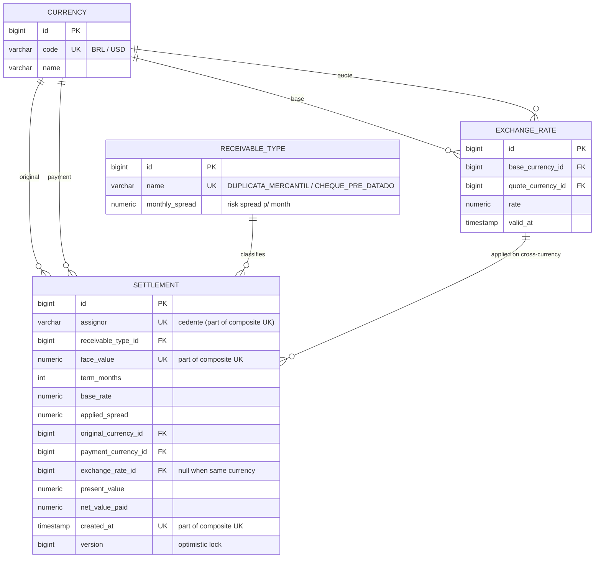

# Diagrama ER - SRM Credit Engine

```mermaid
erDiagram
    CURRENCY ||--o{ EXCHANGE_RATE : "base"
    CURRENCY ||--o{ EXCHANGE_RATE : "quote"
    CURRENCY ||--o{ SETTLEMENT : "original"
    CURRENCY ||--o{ SETTLEMENT : "payment"
    RECEIVABLE_TYPE ||--o{ SETTLEMENT : "classifies"
    EXCHANGE_RATE ||--o{ SETTLEMENT : "applied on cross-currency"

    CURRENCY {
        bigint id PK
        varchar code UK "BRL / USD"
        varchar name
    }

    RECEIVABLE_TYPE {
        bigint id PK
        varchar name UK "DUPLICATA_MERCANTIL / CHEQUE_PRE_DATADO"
        numeric monthly_spread "risk spread p/ month"
    }

    EXCHANGE_RATE {
        bigint id PK
        bigint base_currency_id FK
        bigint quote_currency_id FK
        numeric rate
        timestamp valid_at
    }

    SETTLEMENT {
        bigint id PK
        varchar assignor UK "cedente (part of composite UK)"
        bigint receivable_type_id FK
        numeric face_value UK "part of composite UK"
        int term_months
        numeric base_rate
        numeric applied_spread
        bigint original_currency_id FK
        bigint payment_currency_id FK
        bigint exchange_rate_id FK "null when same currency"
        numeric present_value
        numeric net_value_paid
        timestamp created_at UK "part of composite UK"
        bigint version "optimistic lock"
    }
```